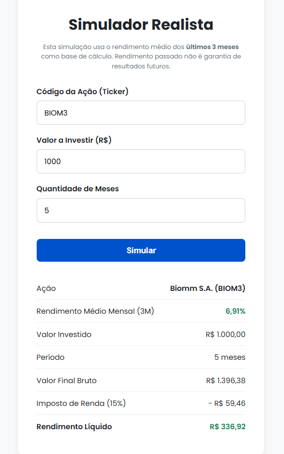

# Simulador de Investimentos Realista


Uma aplicação full-stack que simula o rendimento de ações da bolsa brasileira, utilizando dados de mercado em tempo real e históricos para fornecer uma projeção realista, incluindo o cálculo de Imposto de Renda.

Este projeto foi desenvolvido como um estudo aprofundado do ecossistema Spring Boot para a construção de APIs RESTful robustas, e do consumo dessas APIs com JavaScript puro para criar uma interface de usuário dinâmica e interativa.

## 🖼️ Screenshot da Aplicação



## ✨ Principais Funcionalidades

* **Busca de Ações com Autocomplete:** Interface amigável que sugere tickers de ações enquanto o usuário digita.
* **Dados de Mercado em Tempo Real:** Integração com a API da [Brapi](https://brapi.dev/) para obter cotações atualizadas.
* **Simulação Baseada em Dados Históricos:** O cálculo de rendimento utiliza a média de performance real da ação nos últimos 3 meses, em vez de uma taxa fixa.
* **Cálculo de Imposto de Renda:** Aplica a alíquota de 15% sobre o lucro, oferecendo uma visão do valor final líquido.
* **Interface Reativa:** Frontend construído com HTML, CSS e JavaScript puros, que se comunica com o backend sem a necessidade de recarregar a página.

## 🛠️ Stack de Tecnologia

**Backend:**
* Java 21
* Spring Boot 3.5.6
* Spring Web
* Maven

**Frontend:**
* HTML5
* CSS3
* JavaScript (ES6+)

**API Externa:**
* Brapi - API de Dados do Mercado Financeiro

## 🚀 Como Executar o Projeto Localmente

Siga os passos abaixo para ter o projeto rodando na sua máquina.

### **Pré-requisitos:**
* Java (JDK 17 ou superior)
* Maven 3.8 ou superior
* Git

### **Instalação:**

1.  **Clone o repositório:**
    ```bash
    git clone [https://github.com/dheik/simulador-investimentos.git](https://github.com/dheik/simulador-investimentos.git)
    cd simulador-investimentos
    ```

2.  **Configure o Token da API:**
    Este projeto requer um token da API da Brapi.
    * Acesse [brapi.dev](https://brapi.dev), crie uma conta gratuita e obtenha seu token.
    * Na pasta `src/main/resources/`, crie um arquivo chamado `application.properties`.
    * Adicione a seguinte linha a este arquivo, substituindo `SEU_TOKEN_AQUI` pelo seu token:
        ```properties
        brapi.api.token=SEU_TOKEN_AQUI
        ```
    > **Nota:** Este arquivo está intencionalmente no `.gitignore` para proteger suas chaves secretas.

3.  **Execute a Aplicação Backend:**
    Use o Maven Wrapper para iniciar o servidor Spring Boot.
    ```bash
    ./mvnw spring-boot:run
    ```
    O servidor estará rodando em `http://localhost:8080`.

4.  **Acesse o Frontend:**
    Abra seu navegador e acesse a seguinte URL:
    ```
    http://localhost:8080
    ```
    A interface do usuário já estará disponível e pronta para uso.

## 👨‍💻 Autor

**Diogo Marconato Garcia**

* **Email:** [diogomarconato387@gmail.com](mailto:diogomarconato387@gmail.com)
* **WhatsApp:** [+55 (16) 99769-7364](https://wa.me/5516997697364)
* **LinkedIn:** [Diogo Garcia](https://www.linkedin.com/in/diogo-garcia-6210bb235/)
* Feito por Diogo Marconato Garcia
